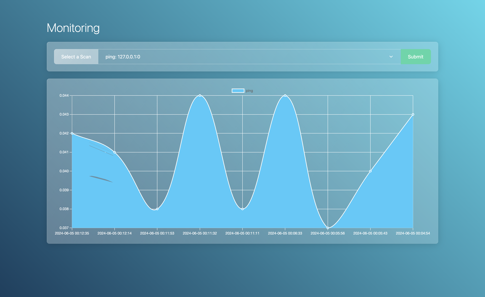

# Monitoring


Monitoring is a crucial part of any network. It allows you to keep track of the health of your network and to detect any issues that may arise.

## Usage
### Command-Line Interface
The command-line interface is the primary way to interact with the monitoring system. It allows you to view the status of the network and to perform various actions.

#### Add a new monitor
To add a new monitor, use the `scan add` command. For example, to add a monitor for the host `example.com`:

```
$ ./cli scan add example.com
```

#### Execute all scans
To execute all scans, use the `scan run` command:

```
$ ./cli scan run
```

### GUI
The GUI provides a graphical interface to the monitoring system. It allows you to view the status of the network and to perform various actions.

#### View scan results
To view the results of a scan, open a browser and navigate to `http://localhost:8000/`. You will see a list of all the scans that have been executed, along with their status and results.

### Setup
The monitoring system consists of a command-line interface and a web server. To set up the system, follow these steps:

1. Install the dependencies:

```bash
$ sudo apt-get update
$ sudo apt-get install -y apache2 php libapache2-mod-php php-mysql php-curl php-gd php-json php-mbstring php-xml php-zip php-common mariadb-server git composer nmap net-tools
```

2. Clone the repository:

```
$ git clone https://github.com/LouisOuellet/monitoring.git
```

3. Assign the appropriate permissions:

```
$ sudo chown -R www-data:www-data monitoring
```

4. Setup Apache:

```
$ sudo nano /etc/apache2/sites-available/000-default.conf
```

Modify DocumentRoot to point to the monitoring directory:
```
# DocumentRoot /var/www/html
DocumentRoot /var/www/monitoring
```

Restart Apache:
```
$ sudo systemctl restart apache2
```

5. Create the database:

```
$ mysql -u root -p
```

Create the database:
```
mysql> CREATE DATABASE monitoring;
```

Create the database user:
```
mysql> CREATE USER 'monitor'@'localhost' IDENTIFIED BY 'password';
```

Grant the necessary permissions:
```
mysql> GRANT ALL PRIVILEGES ON monitoring.* TO 'monitor'@'localhost';
```

Flush the privileges:
```
mysql> FLUSH PRIVILEGES;
```

Exit the MySQL shell:
```
mysql> EXIT;
```

6. Install the dependencies:

```
$ cd monitoring
$ composer update
```

7. Run the Installer:

Open a browser to `http://localhost/monitoring/install` and follow the instructions.

8. Add a cron job to execute the scans periodically. For example, to execute the scans every minute:

```
$ crontab -e
```

Add the following line:
```
* * * * * php /var/www/monitoring/cli scan run
```
