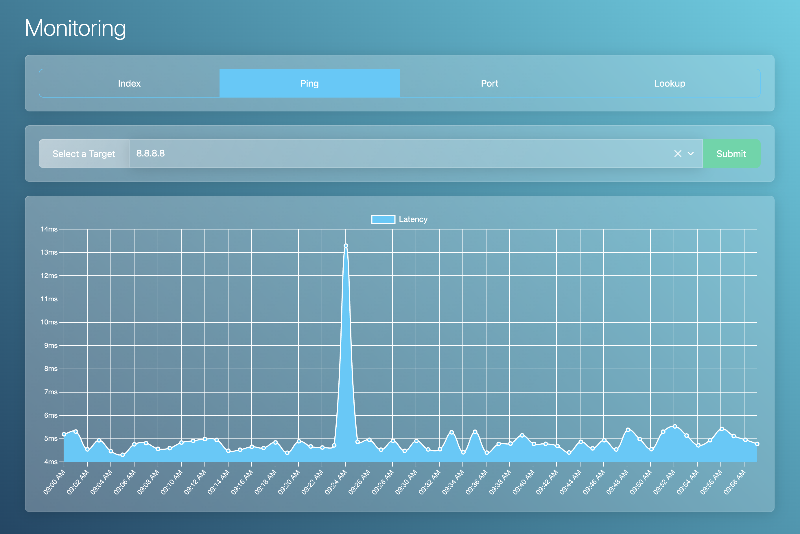

# Monitoring


Monitoring is a crucial part of any network. It allows you to keep track of the health of your network and to detect any issues that may arise.

## Usage
### Command-Line Interface
The command-line interface is the primary way to interact with the monitoring system. It allows you to view the status of the network and to perform various actions.

#### Add a new monitor
To add a new monitor, use the `scan add` command. For example, to add a monitor for the host `example.com`:

```
$ ./cli scan add example.com
```

#### Execute all scans
To execute all scans, use the `scan run` command:

```
$ ./cli scan run
```

### GUI
The GUI provides a graphical interface to the monitoring system. It allows you to view the status of the network and to perform various actions.

#### View scan results
To view the results of a scan, open a browser and navigate to `http://localhost:8000/`. You will see a list of all the scans that have been executed, along with their status and results.

### Setup
The monitoring system consists of a command-line interface and a web server. To set up the system, follow these steps:

1. Clone the repository:

```
$ git clone https://github.com/LouisOuellet/monitoring.git
```

2. Install the dependencies:

```
$ cd monitoring
$ composer update
```

3. Start the web server:

```
$ php -S localhost:8000
```

4. Add a cron job to execute the scans periodically. For example, to execute the scans every minute:

```
* * * * * /path/to/cli scan run
```
